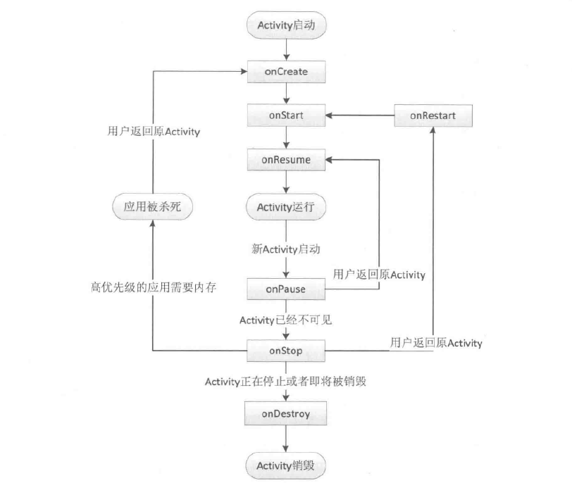

# activity
* activity的生命周期分为两部分内容
 * 典型情况下的生命周期
 >在有用户参与的情况下，activity所经历过的生命周期的改变

 * 异常情况下的生命周期
 >指activity被系统回收或由于当前设备的Configuration发生改变从而导致activity被销毁重建

**典型情况下的生命周期分析**
>正常情况下，activity会经历如下生命周期
>* onCreate：表示activity正在被创建。
 >>* 这是生命周期的第一个方法、在这个方法中，我们可以做一些初始化工作，比如调用setContentView去加载界面布局资源、初始化activity所需要的数据等等
 >>* 通过覆盖onCreate(Bundle)方法，activity可以预处理以下UI相关工作：
 >>+ 实例化组件并将它们放置到屏幕上(调用setContentView(int)方法)
 >>+ 引用已实例化的组件
 >>+ 为组件设置监听器以处理用户交互
 >>+ 访问外部模型数据
>* onRestart：表示activity正在启动。
 >>一般情况下，当当前的activity从不可见重新变为可见的状态时，onRestart就会被调用。**这种情况一般都是用户导致的，当用户按Home键切换到桌面的或者用户打开了一个新的activity，这时当前的activity就会暂停，也就是onPause和onStop被执行，接着用户又回到了这个activity，就会出现这种情况**
>* onStart：表示activity正在被启动，即将开始。
>>这时activity已经可见了，但是还没有出现在前台，还无法和用户交互。这个时候其实可以理解为activity已经显示出来了，但是我们还看不到
>* onResume：表示activity已经可见了，并且出现在前台并开始活动。
>>要注意这个和onStart的对比，onStart和onResume都表示activity已经可见，但是onStart的时候activity还在后台，onResume的时候activity才显示到前台。
>* onPause：表示activity正在停止，正常情况下，紧接着onStop就会被调用。
>>在特殊情况下， 如果这个时候快速地再回到当前activity，那么onResume会被调用。可以理解为这种属于极端的情况，用户操作很难重现这种场景。此时可以做一些存储数据、停止动画等工作，但是注意不能太耗时，因为这会影响到新的activity的显示，onPause必须先执行完，新activity的onPause才会执行。
>* onStop：表示activity即将停止，可以做一些稍微重量级的回收工作，同样不能太耗时。
>* onDestroy：表示activity即将被销毁。
>>这是activity生命周期中的最后的一个回调，在这里，我们可以做一些回收工作和最终的资源释放。
>
>
>
