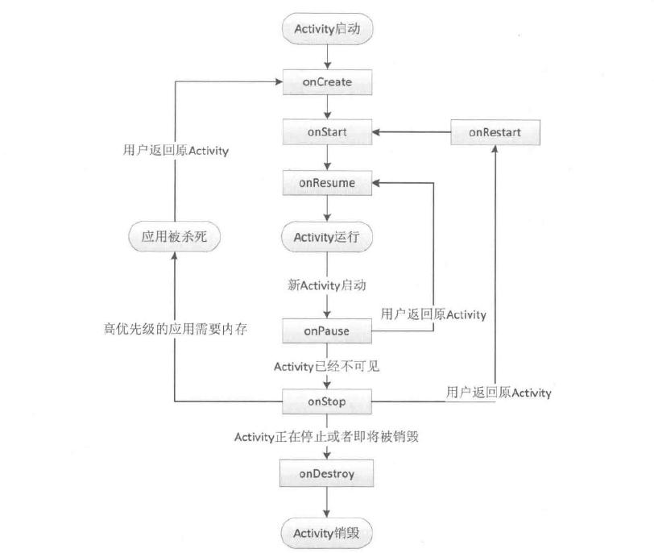

# activity
* activity的生命週期分為兩部分內容
 * 典型情況下的生命週期
 >在有用戶參與的情況下，activity所經歷過的生命週期的改變

 * 異常情況下的生命週期
 >指activity被系統回收或由於當前設備的Configuration發生改變從而導致activity被銷毀重建

**典型情況下的生命週期分析**
>正常情況下，activity會經歷如下生命週期
>* onCreate:表示activity正在被創建，這是生命週期的第一個方法、在這個方法中，我們可以做一些初始化工作，比如調用setContentView去加載界面佈局資源、初始化activity所需要的數據等等
>* onRestart:表示activity正在啟動。一般情況下，當當前的activity從不可見重新變為可見的狀態時，onRestart就會被調用。
>*
>*
>*
>*
>*
>
>
>
