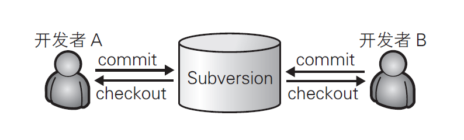
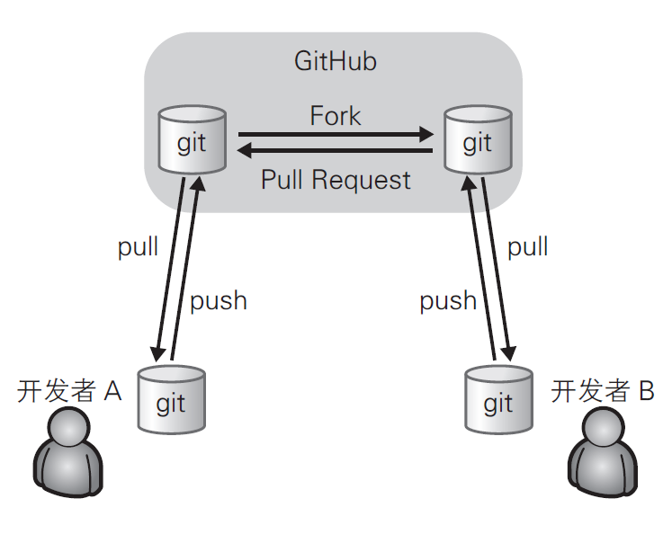

# Git
## What is Git?
* Git is the most advanced distributed version control system in the world.
## What is the different between the SVN(Subversion) and the Git?
* SVN is a centralized version control system which version library  centralized packed in the central server.So if you need to do your work,you must go to the central server to download the latest version.When you finished your work,you have to push on the central server.It's so inconvenient.Actually the centralized version control system must accessible networking.
##### just like this photo

* Git is a distributed version control system,which advantaged is if it has not a central version,the LapTop is a rounded version library.because of this, you can work without using network.
##### just like this photo

## there are some useful command lines :
* mkdir: XX (Create an empty directory)/*XX refer to directory name*/
* pwd: (Show the path to the current directory)
* git: init (Change the current directory to a managed  Git repository,create a hidden file)
* git add XX (Add  XX file to working-storage section)
* git commit -m "XX" (Add a comment to a file)/*XX is the comment*/
* git status (View warehouse status)
* git log (View history)
* git diff XX (View XX file what are modified)
* git rm XX (Delete XX file)
* cat XX (View file contents)
* git checkout -b A  (Create a A branch and switch to A branch)
* git checkout master (back to master branch)
* git clone HTTPS (clone from online warehouse)
* git branch name (create a branch)
* git branch -d A (Delete A branch)
* git push origin master (push master branch to online warehouse)

# 如何使用Git Bash

## 新建
+ 第一步：当需要上传一个项目到Github时，这个时候你需要在自己的Github上新建一个项目New repository
+ 第二步：在右下角有一个Clone or download点击之后有一个Clone with HTTPS Use Git or checkout with SVN using the web URL.
+ 第三步：复制地址之后在需要上传的项目文件中右键，点击Git Bash Here之后先输入 git clone + 地址。
+ 第四步：这时会出现一个项目名称的文件夹里面有隐藏文件.git与README.md
+ 第五步：将具有项目名称的文件夹中的全部内容剪切到需要上传的项目的根目录下之后在Git Bash中输入git add .

+ 第六步：然后在本地执行提交操作git commit -m "//在这里面输入你的内容，比如：First commit."

+ Finally：将提交的内容同步到远程版本库，也就是GitHub上面：git push origin master

## 更新

+ 当需要更新已经上传的项目时，直接在已经写好的更新过的项目中
右键，点击Git Bash Here然后在命令行中输入：

git pull + 地址

+ 上传跟新过之后，需要在命令行中输入git add .之后的步骤又是重复着之前的了然后在本地执行提交操作

git commit -m "//在这里面输入你的内容，比如：First commit."

+ 最后将提交的内容同步到远程版本库，也就是Github上面：

git push origin master

> 小技巧：

+ 当仓库中的内容或者说提交次数过多的情况下，`.git`文件夹下所含有的内容是十分庞大的，因此可以使用如下命令只`拉取最近一次的提交`情况：

**git clone --depth 1 + 地址**
