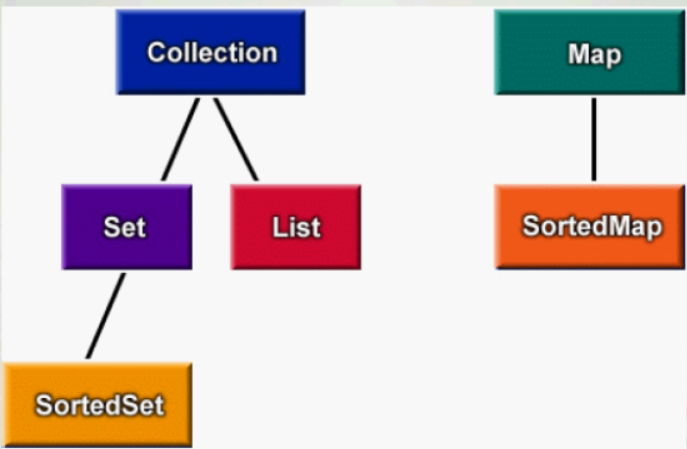

# IDE的詳細介紹
* 對於java中的常量的命名規則：
 * 所有單詞的字母都是大寫，如果有多個單詞，那麼使用下劃線連接即可。比如說：
  * public static final int AGE_OF_PERSON = 20;
* 常量起的作用：（代碼如下：）

```java
public class Authorization
{
  public static final int   MANAGER = 1;
  public static final int   DEPARTMENT = 2;
  public static final int   EMPLOYEE = 3;

}
public class Test
{
  public boolean canAccess(int access)
  {
    if (access == Authorization.MANAGER)
    {
      return true;//經理訪問權限
    }
    if(access == Authorization.DEPARTMENT)
    {
      return false;//部門經理的訪問權限
    }
    if (access == Authorization.EMPLOYEE)
    {
      return false;//普通員工的訪問權限
    }

    return false;
  }
}

```

* 在java中聲明final常量時通常都會加上static關鍵字，這樣對對象的每個實例都會訪問唯一一份的常量值。
## Java中的集合框架



* 上面是集合框架的接口
* 所謂框架就是一個類庫的集合。集合框架就是一個用來表示和操作集合的統一架構，包含了實現集合的接口與類。
## IDE（Integrated Development Environment）（集成開發環境）
 * 第一個：NetBeans（https://www.NetBeans.org/）
 * 第二個：JBuilder
 * 第三個：IntelliJ IDEA
 * 第四個：Eclipse（日蝕、月蝕）
