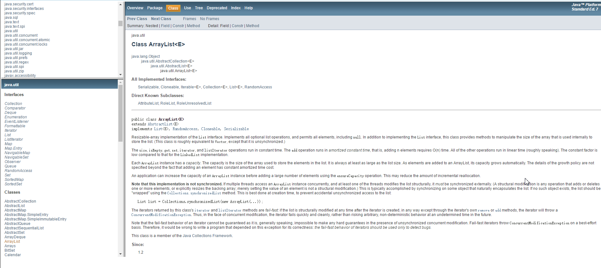
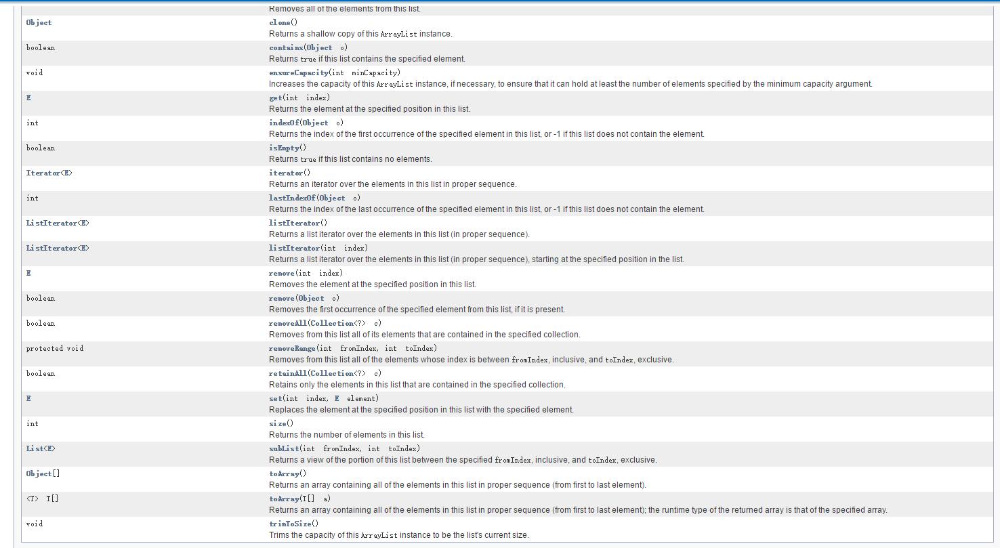

# ArrayList
* Java中的动态数组，可以用来动态的开辟空间用于存储数据。
 * 位于java.util包中
 * 继承的接口有：Serializable, Cloneable, Iterable<E>, Collection<E>, List<E>, RandomAccess
 * 继承ArrayList的子类有：AttributeList, RoleList, RoleUnresolvedList

```
public class ArrayList<E>
extends AbstractList<E>
implements List<E>,RandomAccess,Cloneable,Serializable

```

* 增加内容：
 * ArrayList.add(E e)/*Appends the specified element to the end of this list.*/(将指定元素按照列表的形式排列到结束)
 * ArrayList.add(int index,E element)/*Inserts the specified element at the specified position in this list.*/(插入算法，将指定元素插入到指定的位置上)
 * ArrayList.addAll(Collection<？extends E> c)
 * ArrayList.addAll(int index,Collection<? extends E> c)
 * 上面两种方法是将第一个生成的对象插入到第二个对象之后或者是指定位置。（*代码如下：*）

```Java
import java.util.ArrayList;
import java.util.List;

/*
 * Here we will learn how to append elements from a Collection to ArrayList.
 */
public class AppendAllElementOfCollection {

 public static void main(String args[]) {
 List<Integer> list = new ArrayList<Integer>();

 /*
 * add() method appends the specified element to the end of given list.
 */
 list.add(1);
 list.add(2);
 list.add(3);
 list.add(4);

 List<Integer> listToAppend = new ArrayList<Integer>();

 /*
 * This is the second collection whose elements needs to be added in
 * first collection
 */
 listToAppend.add(5);
 listToAppend.add(6);
 listToAppend.add(7);
 listToAppend.add(8);

 System.out.println("Elements in Arraylist");
 /*
 * As ArrayList implements Iterable, ArrayList can be used in extended
 * For Loop
 */
 for (int i : list)
 System.out.println(i);

 /**
 * ArrayList have a Overloaded method(addAll(Collection<? extends E> c))
 * which appends all of the elements in the specified collection to the
 * end of given list, in the order elements are returned by the
 * specified collection's iterator. The behavior of this operation is
 * undefined if the specified collection is modified while the operation
 * is in progress.
 */
 list.addAll(listToAppend);

 System.out
 .println("nElements in ArrayList after appending all elements from Collection");

 for (int i : list)
 System.out.println(i);

 }
}
```

* 清除：ArrayList.clear()/*Removes all of the elements from this list.*/(清除列表中所有的元素)
* 复制：ArrayList.clone()/*Returns a shallow copy of this ArrayList instance.*/(返回一个ArrayList的拷贝实例)
* 判断是否包含元素：ArrayList.contains(Object o)/*Returns true if this list contains the specified element.*/(判断列表中是否包含某种元素，若包含则返回true)

## 注：还有更多的ArrayList的方法可以参考官方文档

[java.util.ArayList](http://tool.oschina.net/apidocs/apidoc?api=jdk_7u4)



* -------------------这是一条分割线(下面是ArrayList另外具有的方法)--------------------------


