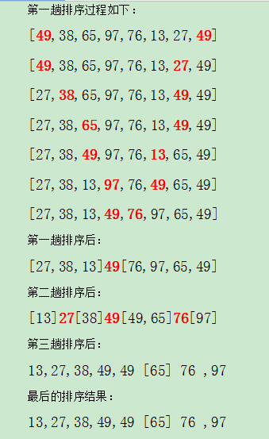

## 冒泡排序的JAVA實現
* 冒泡排序
```java
public class BUbbleSortTest
{
  /*
  一共兩層循環
  最外層循環是進行走到哪裡了，進行一個循環。從數組兩頭一直走到中間的元素
  最裡面的for循環是用來判斷相鄰的兩兩個數的大小，進行互換
  */
  public static void BUbbleSort(int [] array)
  {
    for (int i=0;i<array.length-1;i++ )
    {
      for (int j=0;j<array.length-i-1;j++ )
      {
        if (array[j]>array[j+1])
        {
          int temp = array[j];
          array[j]= array[j+1];
          array[j+1]=temp;
        }
      }
      System.out.println("第"+(i+1)+"趟排序");
      for (int k = 0;i<array.length;i++)
      {
        System.out.println(array[i] + " ");
      }
      System.out.println();
    }
  }

  public static void main(String[] args) {
        int [] array = {4,7,8,9,3,2};
        BUbbleSort(array);
  }
}
```
## 快速排序算法java實現
* 快速排序
> **整體的實現邏輯是基於冒泡排序,直接可以將關鍵字較大的記錄從前面直接移動到後面,關鍵字較小的記錄從後面直接移動到前面,從而減少了總的比較次數與移動次數.**
>
>
* 代碼如下:
```java
public class QuickSort {
    public static void sort(int a[], int low, int hight) {
        int i, j, index;
        if (low > hight) {
            return;
        }
        i = low;
        j = hight;
        index = a[i]; // 用子表的第一个记录做基准
        while (i < j) { // 从表的两端交替向中间扫描
            while (i < j && a[j] >= index)
                j--;
            if (i < j)
                a[i++] = a[j];// 用比基准小的记录替换低位记录
            while (i < j && a[i] < index)
                i++;
            if (i < j) // 用比基准大的记录替换高位记录
                a[j--] = a[i];
        }
        a[i] = index;// 将基准数值替换回 a[i]
        sort(a, low, i - 1); // 对低子表进行递归排序
        sort(a, i + 1, hight); // 对高子表进行递归排序

    }

    public static void quickSort(int a[]) {
        sort(a, 0, a.length - 1);
    }

    public static void main(String[] args) {

        int a[] = { 49, 38, 65, 97, 76, 13, 27, 34 };
        quickSort(a);
        System.out.println(Arrays.toString(a));
    }
}
```
