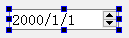
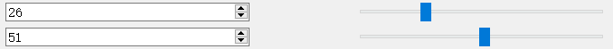

# 控件的使用
**在这里所要讲到的，就是快速开发中的控件的使用。**

+ QDateEdit
 + 控件效果为：

 

 + 例如，使用其`获取系统时间`（代码如下）：

 ```
 //获取系统日期
 QDateTime sysTime = QDateTime::currentDateTime();
 QStringList list = sysTime.toString("yyyy-MM-dd").split('-');
 ui.dateEdit->setDate(QDate(list[0].toInt(),list[1].toInt(), list[2].toInt()));
 ```

+ 控件与信号槽的使用
 + 先使用QSpinBox控件和QSlider控件创建布局（如下图所示）：
 
 + 下面是控件基于信号槽的使用（代码如下）：

 **位于QTGUITest.h中**

 ```
 private slots:
	void slider1_valuechanged(int value)
	{
		ui.spinBox->setValue(value);
	}
	void slider2_valuechanged(int value)
	{
		ui.spinBox_3->setValue(value);
	}
 ```

 **位于QTGUITest.cpp中**

 ```
 //关联QSlider控件
 connect(ui.horizontalSlider, SIGNAL(valueChanged(int)), this, SLOT(slider1_valuechanged(int)));
 connect(ui.horizontalSlider_3, SIGNAL(valueChanged(int)), this, SLOT(slider2_valuechanged(int)));
 ```

 + 最后实现的效果如下：

 
