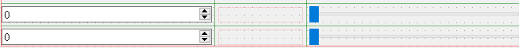

# 控件的使用
**在这里所要讲到的，就是快速开发中的控件的使用。**

+ QDateEdit
 + 控件效果为：

 

 + 例如，使用其`获取系统时间`（代码如下）：

 ```
 //获取系统日期
 QDateTime sysTime = QDateTime::currentDateTime();
 QStringList list = sysTime.toString("yyyy-MM-dd").split('-');
 ui.dateEdit->setDate(QDate(list[0].toInt(),list[1].toInt(), list[2].toInt()));
 ```

+ 控件与信号槽的使用
 + 先使用QSpinBox控件和QSlider控件创建布局（如下图所示）：
 
 + 下面是控件基于信号槽的使用（代码如下）：

 + **位于QTGUITest.h中**

 ```
 private slots:
	void slider1_valuechanged(int value)
	{
		ui.spinBox->setValue(value);
	}
	void slider2_valuechanged(int value)
	{
		ui.spinBox_3->setValue(value);
	}
 ```

 + **位于QTGUITest.cpp中**

 ```
 //关联QSlider控件
 connect(ui.horizontalSlider, SIGNAL(valueChanged(int)), this, SLOT(slider1_valuechanged(int)));
 connect(ui.horizontalSlider_3, SIGNAL(valueChanged(int)), this, SLOT(slider2_valuechanged(int)));
 ```

 + 最后实现的效果如下：

 

 + 键盘输入实现
 + **在QTGUITest.h中添加函数**

 ```
 private void  keyPressEvent(QKeyEvent *);
 ```

 + 然后**在QTGUITest.cpp中实现**

 ```
 void QTGUITest::keyPressEvent(QKeyEvent *e)
 {
   switch(e->key())
   {
     //减法键
     case Qt::Key_Minus:
          ui.textBrowser->insertPlainText("-");
          break;
     //乘法键
     case Qt::Key_Asterisk:
          ui.textBrowser->insertPlainText("*");
          break;
          //除法键
  	case Qt::Key_Slash:
  		ui.textBrowser->insertPlainText("/");
  		break;
  		//取模键
  	case Qt::Key_Percent:
  		ui.textBrowser->insertPlainText("%");
  		break;
  		//乘方键
  	case Qt::Key_AsciiCircum:
  		ui.textBrowser->insertPlainText("^");
  		break;
   }
 }
 ```

 ***上面的的Key的键位还有很多种，可以去参照QT的官方文档进行查阅。***

 + 获取到textBrower里面的内容并将其转化为char*类型

 ```
	QString str = ui.textBrowser->toPlainText();
	QByteArray ba = str.toLatin1();
	ch = ba.data();
 ```

 + int类型转换为QString类型

 ```
 int _mStackSize;
 QString s3 = QString::number(_mStackSize);
 ```
