# Qt Designer
## QT的安装
+ 对于QT的安装，个人的推荐是参考[QT5.7+VS2015安装教程](http://blog.csdn.net/liang19890820/article/details/53931813)。这个教程写的很详细，而且也非常的nice。
## QT在VS2015中的使用
+ 现在我们正式在VS2015中去使用QT，使用前，先需要创建一个QT的项目。
+ 使用VS2015中文件——>新建——>项目。点击之后，会出现如下界面：
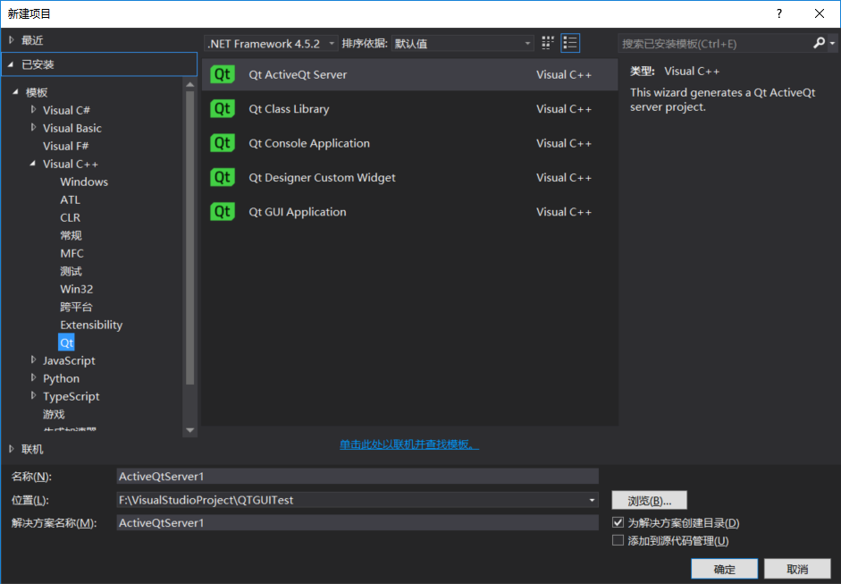
+ 模板选择VisualC++下的Qt，选择QT GUI Application，上方的.NET Framework直接选择默认即可。
+ 选择之后点击下一步，会出现如下界面：
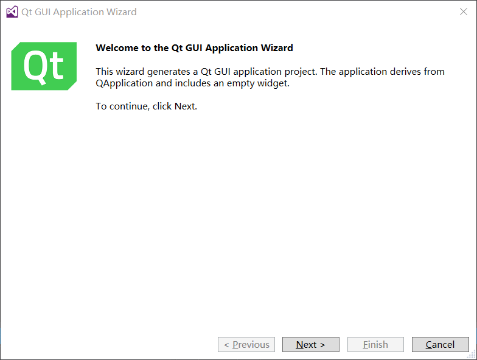
+ 点击next之后会出现如下界面：
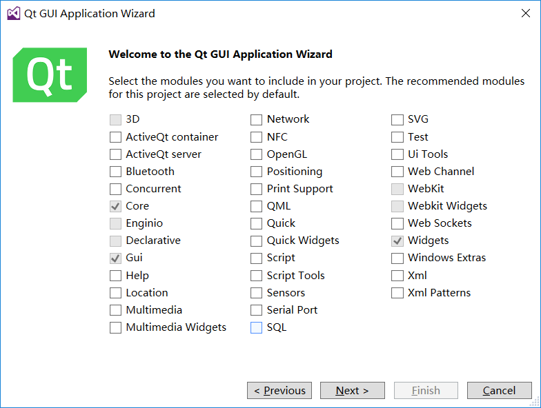
**这里根据需要可以自己选择，如果是新手可以先直接下一步。**
+ 点击next之后会出现如下界面：
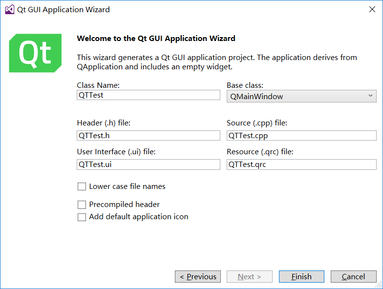
**这里默认直接finish就可以，如果有什么需要的可以自行设置。**
+ 当创建好之后就会出现如下画面：
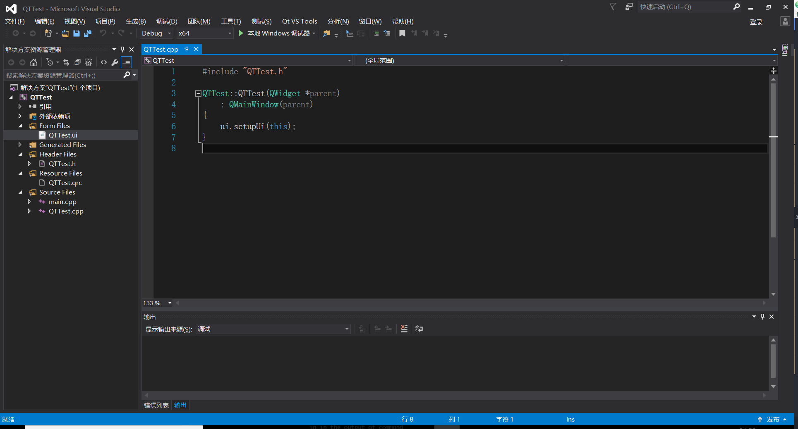
+ 上面的画面就是我们需要进行操作的界面了。此时，`双击`QTTest.ui【位于:解决方案资源管理器->Form Files】
+ 双击进去之后就是我们需要进行ui设计的界面了（如下图所示）：
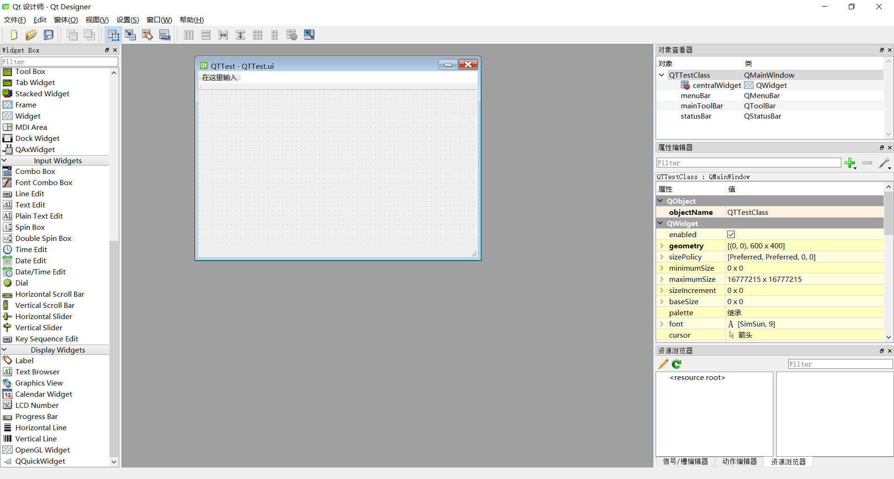
+ 在这里，你可以进行控件的拖动，直接拖到方框中去，然后再对象查看器（如下图所示）可以看到你控件所对应的类以及生成的对象。
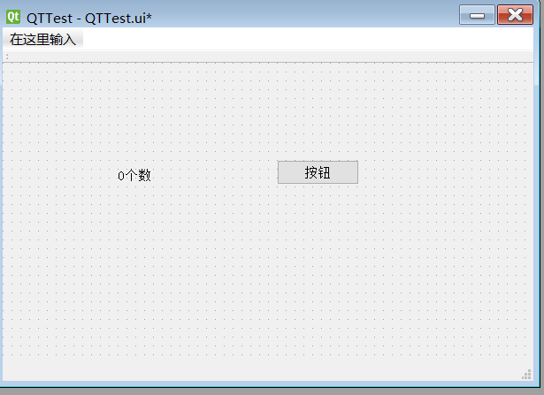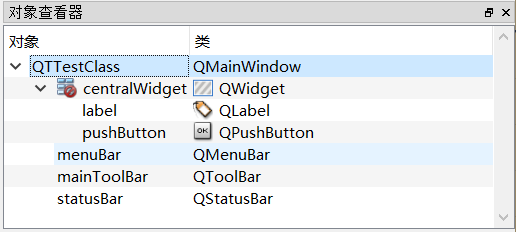
+ 创建好对象之后，点击左上角的文件->保存（Ctrl+S）
+ 然后关闭QT Designer，回到VS2015中，`右键QTTest.ui，选择编译（Ctrl+F7）`，如下图所示：
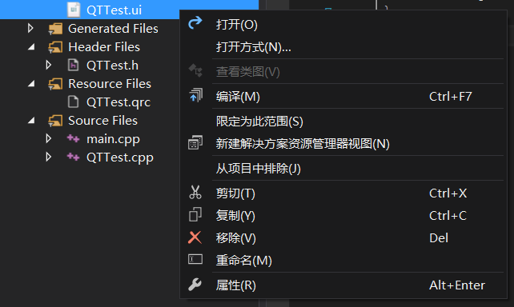
+ 编译成功之后（一般情况下都是会编译成功的），`双击打开QTTest.cpp`,里面的代码是这样的：

```
#include "QTTest.h"

QTTest::QTTest(QWidget *parent)
	: QMainWindow(parent)
{
	ui.setupUi(this);
}
```

+ 这个时候，在`ui.setupUi下输入ui.pushButton`即可获取到刚刚创建的button的实例。代码如下所示：

```
#include "QTTest.h"

QTTest::QTTest(QWidget *parent)
	: QMainWindow(parent)
{
	ui.setupUi(this);
	ui.pushButton;
}
```

+ **在QT中，控件与控件之间的数据传输是通过`信号与槽`的方式进行的，下面就演示其中一种的数据传输的方式：（代码如下：）**

```
#include "QTTest.h"

QTTest::QTTest(QWidget *parent)
	: QMainWindow(parent)
{
	ui.setupUi(this);
	connect(ui.pushButton, &QPushButton::clicked, [this] {
		ui.label->setText(ui.label->text().replace(QRegExp("\\d+"), "25"));
	});
}
```

+ 实现之后的效果为：
 + 未点击button之前：
 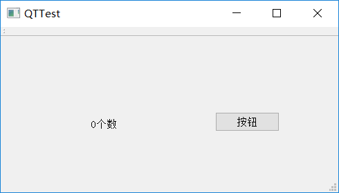

 + 点击button之后：
 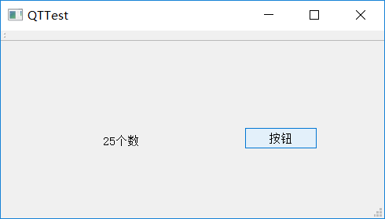
