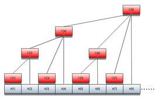

# 樹狀數組
* 這是一個基於二進制的一種線段樹搜索算法

### 這個的主要思想是“二進制”



* 代碼如下：
```c++
#include<iostream>
using namespace std;
int n,m,i,num[100001],t[200001],l,r;//num:原数组；t：树状数组
int lowbit(int x)
{
    return x&(-x);
}
void change(int x,int p)//将第x个数加p
{
    while(x<=n)
    {
        t[x]+=p;
        x+=lowbit(x);
    }
    return;
}
int sum(int k)//前k个数的和
{
    int ans=0;
    while(k>0)
    {
        ans+=t[k];
        k-=lowbit(k);
    }
    return ans;
}
int ask(int l,int r)//求l-r区间和
{
    return sum(r)-sum(l-1);
}
int main()
{
    cin>>n>>m;
    for(i=1;i<=n;i++)
    {
        cin>>num[i];
        change(i,num[i]);
    }
    for(i=1;i<=m;i++)
    {
        cin>>l>>r;
        cout<<ask(l,r)<<endl;
    }
    return 0;
}
```
