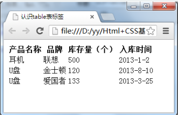

# HTML+CSS

* 外壳的框架

```html
<html>
 <head>
 <meta http-equiv="Content-Type" content="text/html; charset=utf-8"/>
 <!--下面的title写的是你的标签名-->
 <title></title>
 </head>
 <body>
   <!--这里面写的是你想要显示的东西-->
 </body>
</html>
```

* < p >段落文本< /p >

**一个< p >代表一个段落，这个是插入段落文本用的**

****
* < hx >标题文本< /hx >(x为1~6)


**hx中的x表示标签字号的大小，h1位最大，h6为最小**
****
* < em >斜体标签< /em >
* < strong >粗体标签< /strong >

**在这两个标签中都是需要强调的文本，只不过这两种标签所强调出来的样式不一样，但是可以两者结合在一起使用**

****
* < span >标签< /span >

**< span >标签是没有语义的，它的作用就是为了设计单独的样式用的，相当于自定义CSS**
>* aqua 浅绿色
* black 黑色
* blue 蓝色
* fuchsia 紫红色
* gray 灰色
* green 绿色
* lime 绿黄色
* maroon 栗色
* navy 深蓝色
* olive 橄榄色
* purple 紫色
* red 红色
* silver 银白色
* teal 蓝绿色
* white 白色
* yellow 黄色

>***如果使用其它颜色的话，就应该使用十六进制的颜色值***

**< em >< /em >和< strong >< /strong >标签是为了强调一句话中的关键作用，它们的语义是强调**

**< strong >< /strong >和< b >< /b > 一样用法，语义是强调**

****

* < q >标签，短文本引用
```html
<q>引用文本</q>
```

**就像引用别人说的话一样，为了标注，则需要加双引号，但是需要< q >< /q >这样的引用**

**并且这种引用的文本是不需要加**双引号**的，浏览器会对q标签自动添加双引号**

>添加< q >之前，浏览器只知道一段文字和一些双引号在里面。
 >>添加< q >之后，浏览器知道这里是一段引用。
 >>>如果浏览器有自己的优化(如对老人增大引用的字体及对其加粗)，或者你在CSS中安排了格式，这部分就有意义了。

****
* < blockquote >< /blockquote >
>转指对长文本的引用，这个标签的解析是**缩进样式**

**这个与上面的< q >< /q >不一样的地方是：第一、这个是用来表示引用长文本的；第二、这个是不会自动添加双引号，但是会缩进样式。(而< q >< /q >是不会缩进样式的)**

****
* < br >标签分行显示文本
>用一个< br >< /br >就像是回车一样，进行了换行。<br/>
><em><strong>这就意味着你在HTML代码中输入回车、空格都是没有作用的。在HTML文本中想要输入回车换行就必须输入< br ></strong></em><br/>
><em><strong>而< pre >< /pre >可以保留文本中的空格和回车</strong></em>

****
* 输入 & n b s p；就会在html中显示空格
****
* 输入< hr/ >就是用来添加水平线的
****
* < address >标签，为网页加入地址信息
>一般网页中会有一些网站的联系地址信息需要在网页中展示出来，这些联系地址信息如公司的地址就可以< address >标签。也可以定义一个地址（比如电子邮件地址）、签名或者文档的作者身份。
****
* < code >< /code >进行添加代码
><em><strong>目的是防止浏览器误认为是需要执行的代码，加了标签，浏览器就不会执行了<br/><strong>这种只能添加一行代码，如果需要添加多行，就不能使用< code >标签，而需要使用< pre ></strong>
****
* 使用< ul >添加新闻信息列表
>模板：
```html
<ul>
      <li>信息</li>
      <li>信息</li>
      <li>信息</li>
  ……
</ul>
```
****
* 使用< ol >添加列表标签序号
><strong>这种与上面的区别就在于，下面的这一种就是由序号的，而上面的只有一个点</strong><br/>
```html
<ol>
   <li>信息</li>
   <li>信息</li>
   ......
</ol>
```
****
* < div >< /div >标签在排版中的作用
>一个html页面可以看成一个家，而一个div你们可以看成家的每个小房间，房间有了当然没什么效果，但是一个家必须分成一个个小房间才能多姿多彩，但每个房间里怎么装饰就得你们自己放东西，当然装饰就得交给css了。
****
* table标签写表格
>用如下代码实现表格：
```html
<!DOCTYPE HTML>
<html>
<head>
<meta http-equiv="Content-Type" content="text/html; charset=utf-8" />
<title>认识table表标签</title>
</head>
<body>
<table>
  <tbody>
    <tr>
      <th>班级</th>
      <th>学生数</th>
      <th>平均成绩</th>
    </tr>
    <tr>
      <td>一班</td>
      <td>30</td>
      <td>89</td>
    </tr>
    <tr>
      <td>二班</td>
      <td>35</td>
      <td>85</td>
    </tr>
<tr>
<td>三班</td>
<td>32</td>
<td>80</td>
</tr>
  </tbody>
</table>
</body>
</html>
```
上面的代码实现的样子就像下面的样子一样：


****

* <h3>上面的代码可以添加一个CSS样式进行表格的变换</h3>

```html
<title>为表格添加边框</title>
<style type="text/css">
table tr td,th{border:2px solid #342;}
</style>
```

****

* summary与caption用来添加标题与摘要

><strong>< table summary="摘要的内容"></strong><br/>
>上面的summary添加的摘要与在html中添加注释的效果是一样的，目的是为了给程序员看，防止表格太多改错了。<br/>
><strong>< caption >标题文本< /caption ></strong><br/>
>上面的就是给表格添加标题(表头)的
****
* < a >标签使用的超链接
>使用
```html
<a href="目标地址" title="鼠标滑过显示的文本">连接显示的文本</a>
```
><em>href：Hypertext Reference的缩写。意思是超文本引用。</em><br/>
>title属性的作用，鼠标滑过链接文字时会显示这个属性的文本内容。<br/>
><em><strong>注：只要文本加入a标签之后，文字的颜色就会自动变成蓝色（点击之后的文本颜色会变成紫色）</strong></em>
