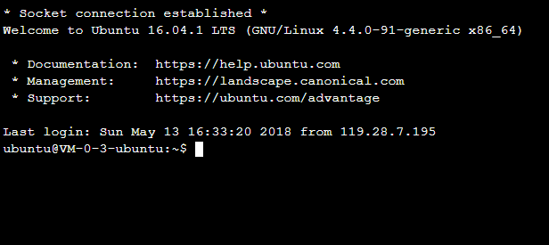
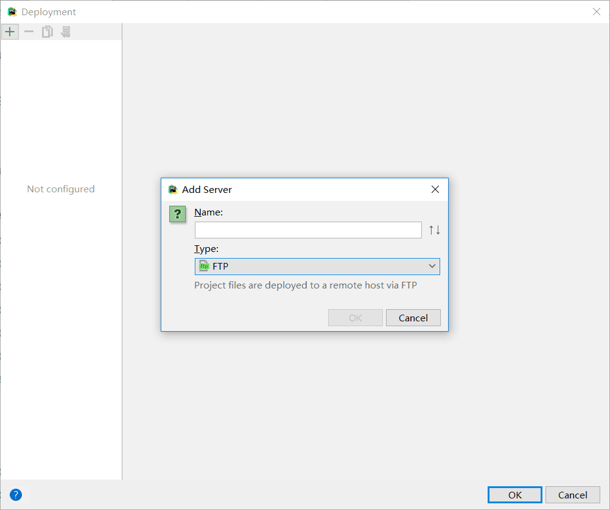
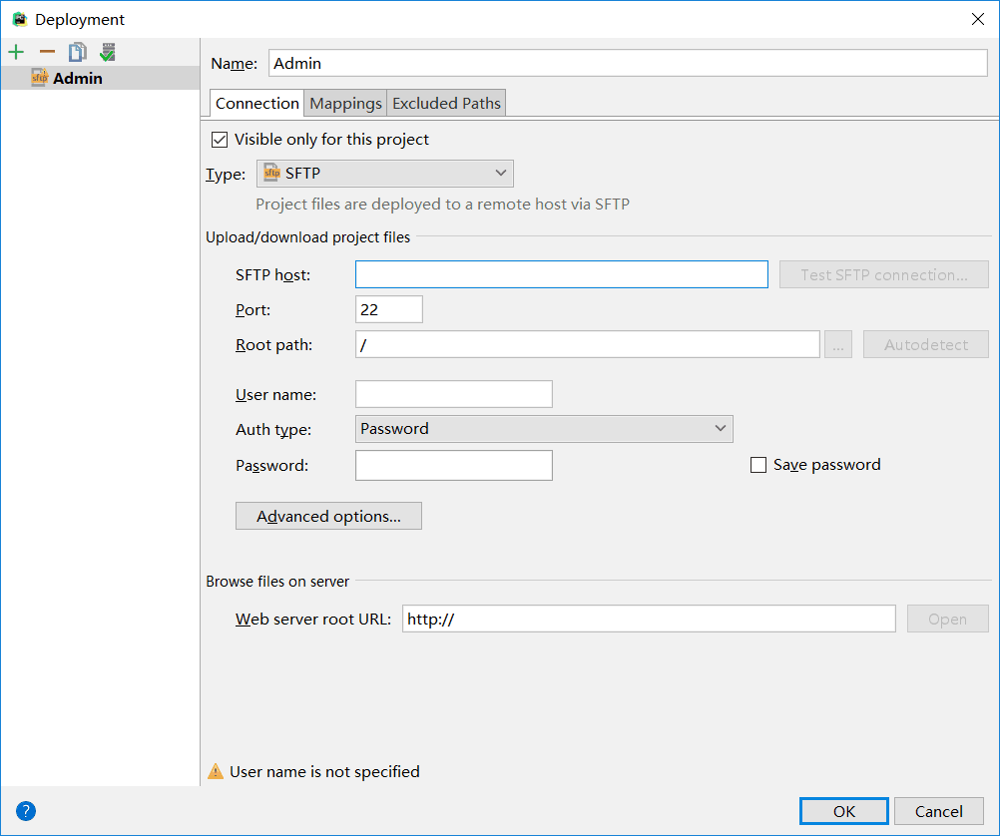
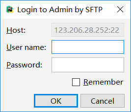
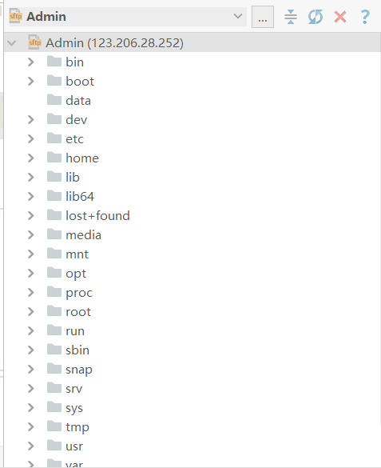

# Django服务器部署到腾讯云
+ 配置腾讯云的服务器
 + 配置的系统是Ubuntu Server 16.04.1 LTS 64位
 + 登录后界面如图：
  - 
  - 之后进行django的安装**注意版本号要和你在本地开发的一致**
  - 使用screen进行后台的django项目的运行。**注意runserver后设置：0.0.0.0:端口号**

+ 使用PyCharm进行远程连接腾讯云服务器
 + Tools-->Deployment-->config呈现下面的界面
  - 
  -
  选择**sftp**
  - 
  - 在这里设置你的IP地址，然后点击`Test SFTP connection`
  - 
  - 在这里设置你的`用户名`和`密码`**用户名与密码可以在腾讯云的更多中重置与设置**
  - 然后这个时候就连接上了
 + 此时，在你的PyCharm的右边，会出现服务器上的树目录结构(如图所示)
  - 
  - 进入到home-->ubuntu下，在这里面，你具有权限，此时就可以将你的整个项目拖进去，然后在服务器端进入到项目中**创建screen后台**，运行**manage.py runserver 0.0.0.0:端口号**就可以使你的django一直保持运行的状态了。
