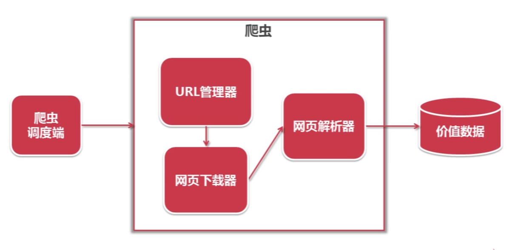
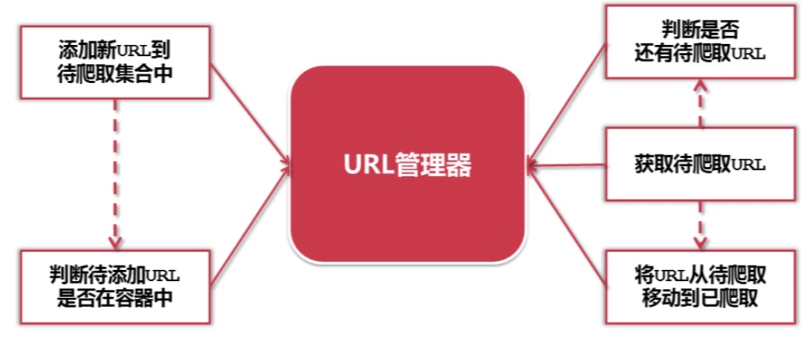
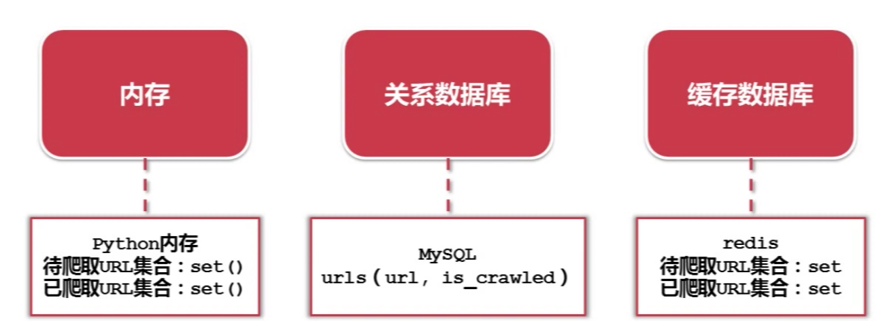
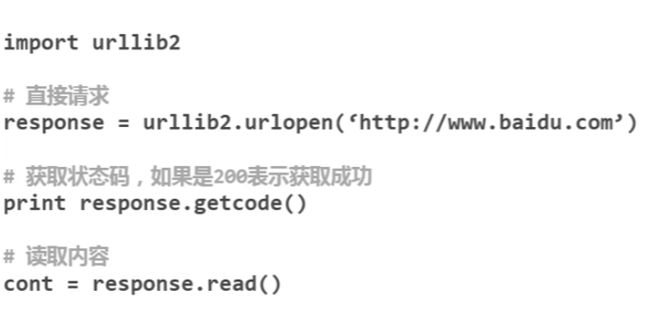
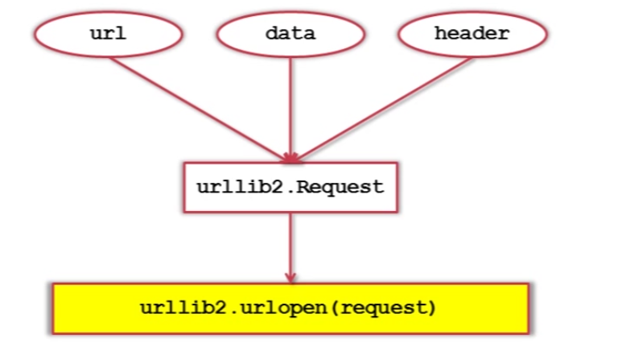
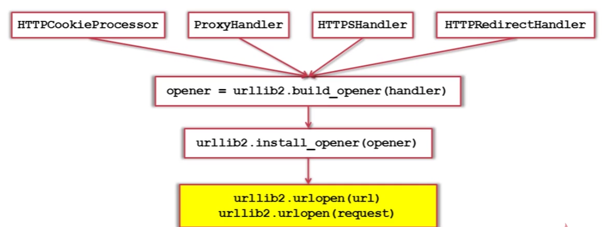

# 爬虫
## 简单爬虫结构

<hr/>
## URL管理器

<hr/>
## URL实现方式

<hr/>
## 这里是一个爬虫网页下载器
### 网页下载器-urllib2
* <em><strong>urllib2下载网页方法1：最简洁方法</em></strong>

* <strong><em>urllib2下载网页方法2：添加data、http、header<strong></em>

* <em><strong>urllib2下载网页方法3：添加特殊情景的处理器</em></strong>

**代码如下**
```python
from urllib import request
import http.cookiejar
url = 'http://www.baidu.com'
print('第一种方法:')
response1 = request.urlopen(url)
print(response1.getcode())
print(len(response1.read()))
print('第二种方法')
req = request.Request(url)
req.add_header('user-agent', 'Mozilla/5.0')
response2 = request.urlopen(req)
print(response2.getcode())
print(len(response2.read()))
print('第三种方法')
cj = http.cookiejar.CookieJar()
opener = request.build_opener(request.HTTPCookieProcessor(cj))
request.install_opener(opener)
response3 = request.urlopen(url)
print(response3.getcode())
print(cj)
print(response3.read())
r = opener.open(req)
print(r.read().decode('utf-8'))
```
## 下面是一个网页解析器
```python
from bs4 import BeautifulSoup
import re
#下面的html_doc是一个例子
html_doc = """
<html><head><title>The Dormouse's story</title></head>
<body>
<p class="title"><b>The Dormouse's story</b></p>
<p class="story">Once upon a time there were three little sisters; and their names were
<a href="http://example.com/elsie" class="sister" id="link1">Elsie</a>,
<a href="http://example.com/lacie" class="sister" id="link2">Lacie</a> and
<a href="http://example.com/tillie" class="sister" id="link3">Tillie</a>;
and they lived at the bottom of a well.</p>
<p class="story">...</p>
"""
soup = BeautifulSoup(html_doc, 'html.parser', from_encoding='utf-8')
print('获取所有链接')
links = soup.find_all('a')
for link in links:
    print(link.name, link['href'], link.get_text())
#这里只想获取Lacie的链接，所以href后面的链接就可以直接复制过来
print('获取Lacie链接')
linknode = soup.find_all('a', href='http://example.com/lacie')
for link in linknode:
    print(link.name, link['href'], link.get_text())
#正则匹配就相当于模糊匹配
print('正则匹配')
linknode = soup.find_all('a', href=re.compile(r'ill'))
for link in linknode:
    print(link.name, link['href'], link.get_text())
print('获取P')
pnode = soup.find_all('p', class_='title')
for link in pnode:
    print(link.name, link.get_text())

```
