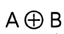

# 程序员的数学
* 二进制
 * 10进制转2进制：将数反复地除以2并观察余数是'1'还是'0'。--->余数是'0'表示'除完了'。
 * 随后再将每步所得到的余数的列(1和0的列)逆向排列。(如下图所示：)

 * 二进制的加法表如下：

* 0的作用
 * 占位
 * 统一标准，简化规则
 >在按位计数法中，运用"0次方"，使用'0'能够将按位计数法的各个数位所对应的大小统一标示
 如：（10进制为例）
     **10^n**   全部表示为：

* 逻辑
 * 能够判断对错的陈述句叫做命题
 * 单个命题的逻辑非--否A
 * 命题与命题之间的关系有:
  * 逻辑与--A并且B
  * 逻辑或--A或者B
  * 异或--A或者B(但不满足) 逻辑表达式写作:
  * 相等--A和B相等
  * 蕴涵--若A则B

#### 以上的复合型逻辑表达式

* 德·摩根定律
 >就是一个逻辑表达式的转换
 
  
