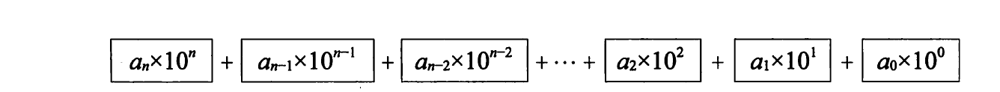
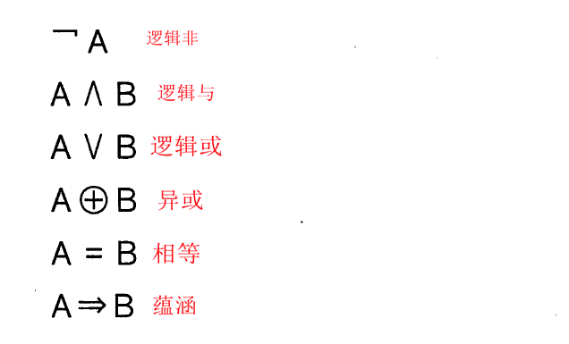
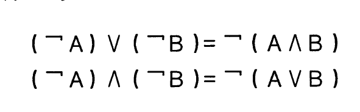

# 程序员的数学
* 二进制
 * 10进制转2进制：将数反复地除以2并观察余数是'1'还是'0'。--->余数是'0'表示'除完了'。
 * 随后再将每步所得到的余数的列(1和0的列)逆向排列。(如下图所示：)

 * 二进制的加法表如下：

* 0的作用
 * 占位
 * 统一标准，简化规则
 >在按位计数法中，运用"0次方"，使用'0'能够将按位计数法的各个数位所对应的大小统一标示
 如：（10进制为例）
     **10^n**   全部表示为：

* 逻辑
 * 能够判断对错的陈述句叫做命题
 * 单个命题的逻辑非--否A
 * 命题与命题之间的关系有:
  * 逻辑与--A并且B
  * 逻辑或--A或者B
  * 异或--A或者B(但不满足) 逻辑表达式写作:
  * 相等--A和B相等
  * 蕴涵--若A则B

#### 以上的复合型逻辑表达式

* 德·摩根定律
 >就是一个逻辑表达式的转换
 

 * 对偶性
 >
 >它们相互成对，这称作逻辑表达式的对偶性

 * 卡诺图(Karnaugh Map)
 >将所有命题的真假组合以二维表的形式表示的图
 >* 这里玩一个游戏：二灯游戏
 >  * 这里有一个游戏机，屏幕上显示着一绿一黄两个灯泡，不断忽闪忽灭。
 >  * 遵守以下跪着迅速按下游戏机按钮
 >  * 1)绿灯灭，黄灯亮
 >  * 2)绿灯、黄灯都灭
 >  * 3)绿灯、黄灯都亮
 >
 >   
 >
 >* 解析：
 >  * 假设命题A：绿灯亮
 >  * 假设命题B：黄灯亮
 >  * 按照题目的意思就有以下a、b、c的三种的逻辑或
 >
 >  
 >
 >**也就是说当以下逻辑表达式为true的时候要按下按钮**
 >
 >
 >

#### 这个时候就需要卡诺图了
1、第一步：打上勾

2、相邻打钩格形成的组合框

3、画出组合框、思考逻辑表达式

### 所以上面特别长的逻辑表达式就被简化成

## 综上所述，卡诺图就是简化逻辑表达式的

* 带条件的逻辑与(&&)
 * 三值逻辑中的逻辑与(带条件的逻辑与(conditional and, short-circuit logical and))
 * 使用运算符&&
 * 三值为(TRUE/FALSE/UNDEFINED)
