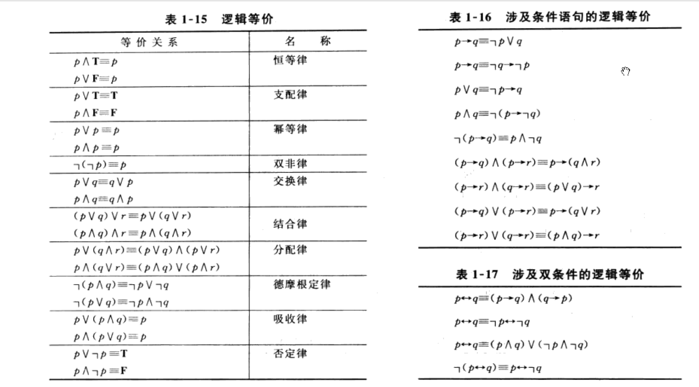

# 逻辑和证明
* 命题————逻辑的基本成分
 >* 令p和q为命题。p、q的析取用p∨q表示，即命题“p或q”。当p和q均为假得到时候，p∨q命题为假，否则为真。
 >#### 注意：连接词“或”在析取中的使用对应于词“或”(or)包含的两种情况之一，即为“同或”(inclusive or)。析取所含两命题之一为真或两者均为真时，析取的真值为真。有的时候我们也按照“异或”的含义使用“或”。

 * 逻辑连接词广泛的应用在大量信息检索中，例如：检索网页索引。
  * 比如：布尔检索

* 模糊逻辑可用于人工智能。————在模糊逻辑中命题的真值是介于0和1(包括0和1)之间的数。以0为真值的命题为假，以1位真值的命题为真。0和1之间的真值表示不同程度的真值。
* 复合命题称为**永真式**(或重言式)，如果无论其中出现的**命题**的真值是什么，它的**真值总是真**。**真值永远为假**的复合命题称为**矛盾**。最后，既不是永真式又不是矛盾的命题称为可能式。

